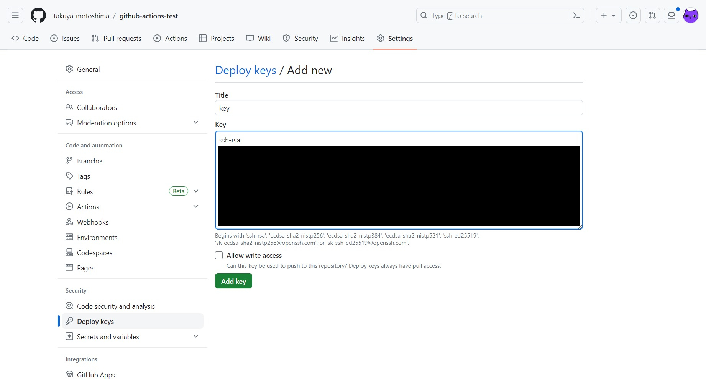
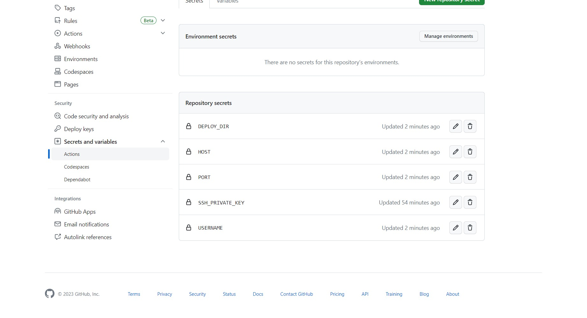
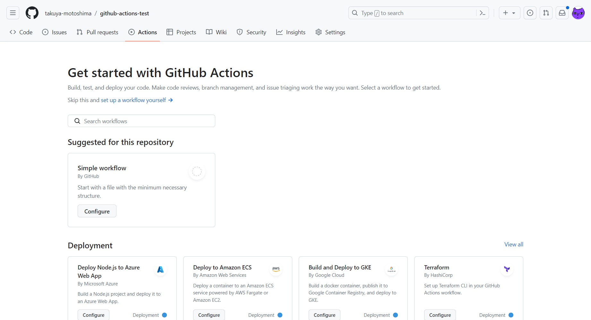
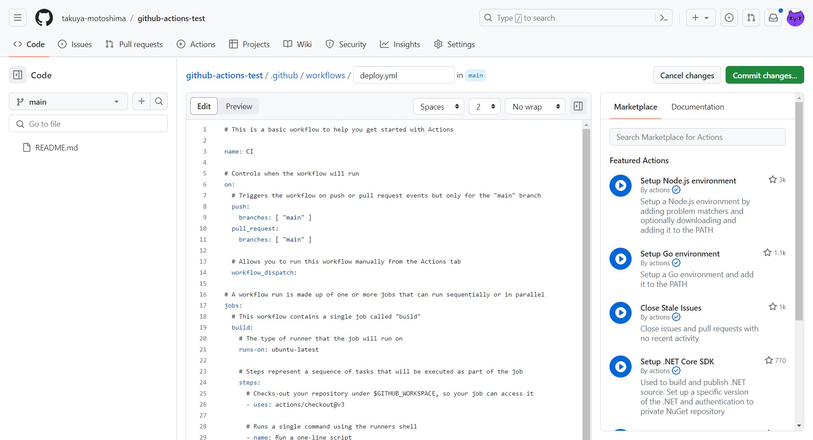
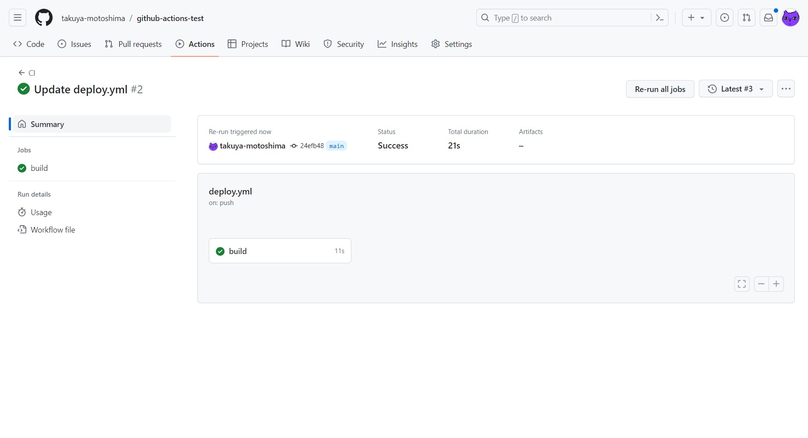
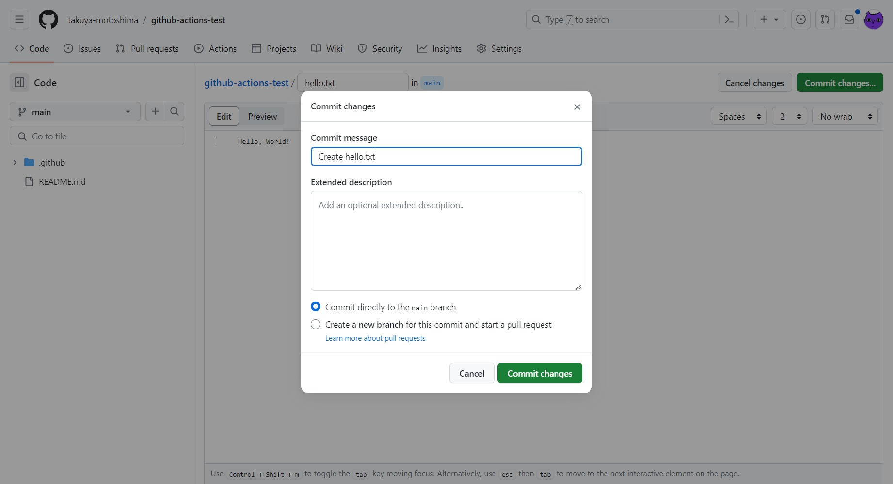

# GitHub Actions 自動デプロイ

- [GitHub Actions 自動デプロイ](#github-actions-自動デプロイ)
    - [手順](#手順)
    - [エラー](#エラー)

## 手順
1. SSHキーペア作成。  
    サーバで次のコマンドを実行して、SSHキーペア作成。

    ```sh
    ssh-keygen -t rsa -b 4096 -f id_rsa_github-actions-test
    ```
1. Deploy keys登録。  
    GitHubの Settings メニューから Deploy keys の登録画面を開く。  
    Add deploy key ボタンを選択肢、Title に任意の名前、Key に先ほど作成したSSHキーペアの公開鍵を入力し、Add Key ボタンを選択し、Deploy keys を登録。

    

    Allow write access は、**サーバーから GitHub リポジトリに対し push** する必要がある場合にチェックする。  
    今回は、**GitHub → サーバー への一方通行**なので、チェックを外している。
1. Secrets登録。  
    Secrets and variables → Actions メニューから Secrets の登録画面を開く。

    New repository secret ボタンを選択し、以下の内容を登録。

    <table width="100%">
        <thead>
            <tr>
                <th>項目</th>
                <th>内容</th>
            </tr>
        </thead>
        <tbody>
            <tr>
                <td>USERNAME</td>
                <td>サーバーのSSHユーザ名</td>
            </tr>
            <tr>
                <td>HOST</td>
                <td>サーバのホスト名</td>
            </tr>
            <tr>
                <td>PORT</td>
                <td>サーバのSSHポート番号</td>
            </tr>
            <tr>
                <td>SSH_PRIVATE_KEY</td>
                <td>サーバーにSSH接続するための秘密鍵</td>
            </tr>
            <tr>
                <td>DEPLOY_DIR</td>
                <td>デプロイ先ディレクトリ</td>
            </tr>
        </tbody>
    </table>

    

    ※設定した値は、この後の手順で作成する Workflow ファイルで <code>${{ secrets.[登録したSecretsの名前] }}</code> と記述する事で呼び出せる。
4. Workflow作成。  
    リポジトリ内の Actions メニューに移動し、Simple workflow の Configure のボタンを押下してWorkflow の Base を取得。

    


    GitHub上のエディタに、Workflow が記載された yml ファイルが展開される。
    ファイル名を変更できるので、今回は deploy.yml としておく。

    

    今回は、main ブランチに push された時にデプロイするよう、deploy.yml を以下内容で置き換える。  
    置き換えたら、Start Commit ボタンを押下して、ファイルをリポジトリに保存。

    ```yml
    name: CI

    on:
      push:
        branches:
          - main

    jobs:
      build:
        runs-on: ubuntu-latest

        steps:
          - name: Deploy
            uses: appleboy/ssh-action@master
            with:
              host: ${{ secrets.HOST }}
              username: ${{ secrets.USERNAME }}
              port: ${{ secrets.PORT }}
              key: ${{ secrets.SSH_PRIVATE_KEY }}
              passphrase: ${{ secrets.SSH_PASS }}
              script: |
                cd ${{ secrets.DEPLOY_DIR }}
                git pull origin main
    ```

    Workflow解説：  
    - name: CI  
        Workflow の名前。デフォルトのまま使っているだけなので、任意のものに書き換えていない。
    - on:  
        アクションが実行されるタイミング。  
        今回は、main ブランチに push された時としている。
    - jobs:  
        実行する処理。
    - rans-on:  
        処理の実行環境。
    - uses:  
        今回利用しているアクション。
    - with:  
        アクションに必要な値を設定し、script: 以下の処理を実行している。

1. 設定した Workflow の動作とエラーを確認する方法。  
    Workflow が正しく動作したかどうかは、GitHub リポジトリの Actions メニューから確認できる。

    

6. テスト
    mainブランチに新規で hello.txt というファイルを作成し、サーバに反映されるか確認。

    


    hello.txt が、自動でサーバにデプロイされている事を確認できた。
    ```sh
    $ ll
    total 8
    -rw-rw-r-- 1 ec2-user ec2-user 14 Jun 27 17:16 hello.txt
    -rw-rw-r-- 1 ec2-user ec2-user 59 Jun 27 17:10 README.md
    ``

## エラー
1. Buildエラーが発生。サーバにリポジトリをcloneする事で解決。
    ```sh
    err: fatal: not a git repository (or any of the parent directories): .git
    2023/06/27 08:05:10 Process exited with status 128
    ```